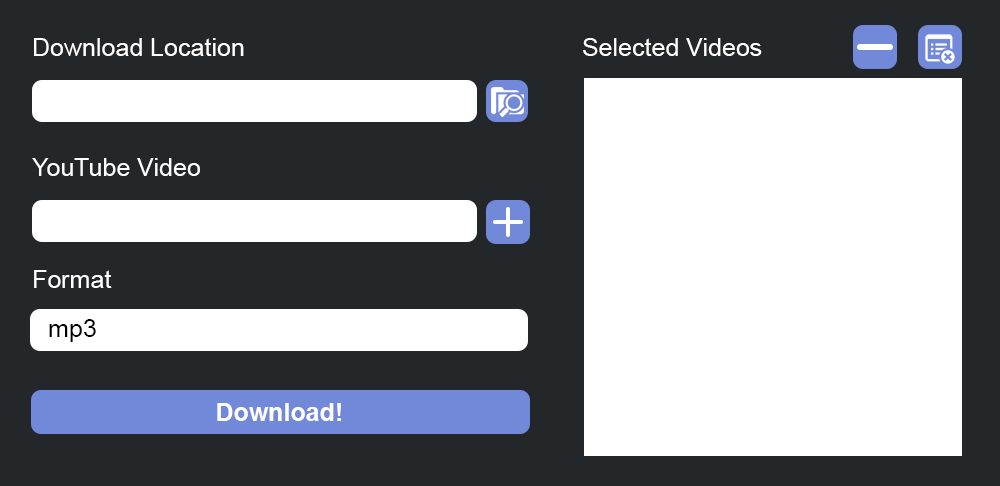

# Simple YouTube Video Downloader
Simple YouTube Video Downloader is an open source project with a very simple UI that tries to speed up the process of downloading YouTube Videos without going to sketchy websites or needing to deal with scripts.

## About the Creator
Hello There! This is my first open-sourced project, and any feedback/criticism is really appreciated! I am primarily a web developer (working with the Django and Angular Frameworks), and this is my first time using Tkinter, so please go easy on me!

## Status
The application currently works on MacOS (may work on Linux and Windows). Currently, we are still working on finishing up the UI and setting up the installables.

Here is our [CHANGELOG](./CHANGELOG.md)!

## Image


## Technology Stack
* PyTube - Used to download the videos
* Tkinter - Used to create the UI

## Installation (for Developers)
1. Install Python
2. Set up a venv
3. Clone the Project
4. ```pip3 install -r requirements.txt```
5. To run the project: ```python3 main.py```

## Project Structure
* forms.py - Holds classes containing forms
    * SaveLocationForm
    * YouTubeVideoForm
    * DownloadForm
* downloader.py - Holds class "Downloader" which contains a static method which does all the YT video downloading.
* main.py - Where the project runs.

----

## Open Source Licensing Info
1. [LICENSE](LICENSE)
2. [CFPB Source Code Policy](https://github.com/cfpb/source-code-policy/)
